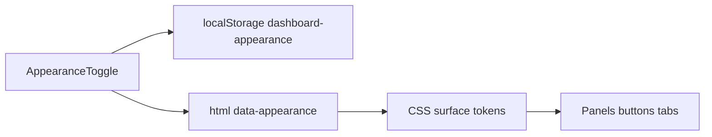

# Brutalist appearance themes + motion

## Defaults (locked)

- Control lives in the masthead **status panel** next to Health Incognito.
- Preference persists in `localStorage` as `dashboard-appearance` (`black` | `dark` | `sepia`), hydrated like `health-average-period` to avoid SSR flicker.
- Motion covers **interactive controls** (buttons, tabs, pills, segmented, Kanban chips) plus **panel/drawer shutter entrances**; sparklines keep their existing draw/hover behavior.
- PDF `/report` stays unthemed (screen-only appearance).

## Architecture




Set `document.documentElement.dataset.appearance` from React after hydrate, plus a tiny blocking script in `[app/layout.tsx](app/layout.tsx)` that reads `localStorage` before paint (FOUC guard). Default when missing/invalid: `black` (current look).

## Theme token layer

Refactor the highest-traffic surfaces in `[app/globals.css](app/globals.css)` from hardcoded `#000` / `#0a0a0a` / `#050505` / `#27272a` to semantic tokens on `:root`, then override per appearance:


| Token                                    | Black (current)           | Dark (GitHub-blueish)           | Sepia                                             |
| ---------------------------------------- | ------------------------- | ------------------------------- | ------------------------------------------------- |
| `--bg-page` / `--bg-app`                 | `#000` / `#050505`        | `#0d1117` / `#0d1117`           | `#2a241c` / `#241f18`                             |
| `--bg-panel` / `--bg-elevated`           | `#0a0a0a`                 | `#161b22`                       | `#332b22`                                         |
| `--bg-control`                           | `#0a0a0a`                 | `#000000` (all black buttons)   | `#f0e6d2` (contrasting)                           |
| `--ink` / `--muted`                      | white / zinc              | `#e6edf3` / `#8b949e`           | `#f5efe3` / `#c4b59a`                             |
| `--line`                                 | `#27272a`                 | `#30363d`                       | `#5c4f3d`                                         |
| `--btn-bg` / `--btn-fg` / `--btn-border` | near-black / white / zinc | `**#000` / `#fff` / `#30363d**` | **cream `#f0e6d2` / ink `#1a140f` / warm border** |
| `--brutalist-shadow`                     | black offset              | black offset                    | deep brown `#1a140f` offset                       |


Keep accent semantics (`--blue`, `--green`, `--amber`, `--red`) stable so Health category accents, freshness dots, and Kanban tones stay meaningful. Preserve `* { border-radius: 0 !important }` brutalist edges.

Wire core selectors to tokens: `html`/`body`, `.dashboard-app`, `.masthead`, `.panel`, `.workspace-tabs button`, `.segmented`, `.incognito-toggle`, `.digest-show-*`, `.source-freshness-strip`, primary `button`/`a` control surfaces. Add appearance blocks:

```css
html[data-appearance="dark"] { ... }
html[data-appearance="sepia"] { ... }
```

Extend `[app/visual-overhaul.css](app/visual-overhaul.css)` `--vo-*` only where shadows/backgrounds would clash (drawer shutters, pulse popovers, mission chips).

## UI control

Add `AppearanceToggle` in `[app/dashboard/shared-ui.tsx](app/dashboard/shared-ui.tsx)` (segmented 3-way: Black / Dark / Sepia), styled like existing brutalist `.segmented` / `.incognito-toggle`.

Wire in `[app/page.tsx](app/page.tsx)` masthead status panel:

```tsx
<AppearanceToggle value={appearance} onChange={setAppearance} />
<HealthIncognitoToggle ... />
```

State pattern:

1. `useState("black")`
2. `useEffect` + `setTimeout(0)` read `localStorage`
3. write on change + set `document.documentElement.dataset.appearance`
4. `hydrated` flag so first write does not clobber stored value

Update `[app/layout.tsx](app/layout.tsx)`: inline FOUC script; keep `colorScheme: "dark"` for all three (all are dark-family); set `themeColor` per appearance only if cheap via meta sync — otherwise leave `#050607` for Black and accept fixed PWA color (screen CSS is the priority).

## Button pop-ups + other motion

In `[app/visual-overhaul.css](app/visual-overhaul.css)`:

1. **Button pop-up** — new `.vo-pop` / global interactive press:
  - hover: shadow expands (`4px 4px` → `6px 6px`)
  - active: brief scale `1.03` + shadow snap (pop), then settle to translated press
  - apply to workspace tabs, segmented buttons, pills, digests show-all, Kanban mission chips, appearance/incognito controls
2. **Panel entrances** — reinforce collapsible drawer shutters with a short `vo-magnetic`-style pop when opening (already partially present; ensure theme-token shadows)
3. **Respect** existing `@media (prefers-reduced-motion: reduce)` kill-switch

Do not reshape Kanban lane geometry (AGENTS invariant) — only motion/color tokens.

## Tests + verification

- Extend `[tests/rendered-html.test.mjs](tests/rendered-html.test.mjs)`: `AppearanceToggle`, `dashboard-appearance`, `data-appearance`, three appearance CSS blocks, `vo-pop` / pop motion selectors.
- Run `npm run lint`, `npm run build`, targeted tests.
- Manual: cycle Black → Dark → Sepia; confirm black buttons on Dark, contrasting cream buttons on Sepia; button pop + reduced-motion off; Health/Kanban layout unchanged.

## Out of scope

- Light / white theme
- Theming PDF report export
- Replacing every hardcoded hex in the entire CSS (tokenize high-traffic surfaces first; residual deep nests inherit via parent backgrounds where possible)

