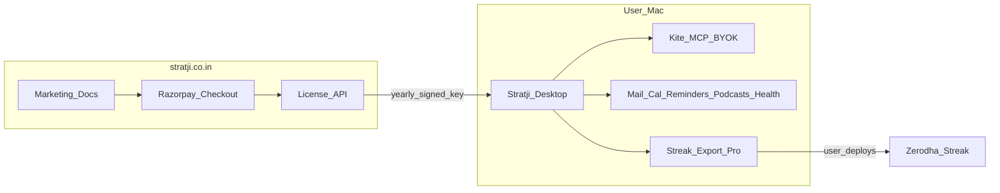

# Stratji B: On-Device Productization Plan

## Product thesis (locked)

**Stratji** is a private **macOS-on-device** market OS. Users bring their own Zerodha Kite keys and Apple data plane. Cloud only handles marketing, license issuance, and billing on [www.stratji.co.in](https://www.stratji.co.in). No multi-tenant hosting of Mail, Health, or broker tokens.

Positioning line: *Your portfolio, your keys, your Mac — one action board.*

Legal posture (locked): Stratji is **software tooling**, not investment advice, not a SEBI Research Analyst product, and not a black-box algo marketplace. Algo features are **white-box, user-authored** strategies with execution routed through **Zerodha Streak** (broker-approved path) and compliance checklists for SEBI/NSE retail algo rules (static IP, order-rate thresholds, Algo-ID registration when required).




---

## Pricing strategy (locked)

Billing: **yearly INR**, one seat = one named user, device soft-limit enforced by license.


| Tier      | Price (INR / year) | Who it is for                                                                               |
| --------- | ------------------ | ------------------------------------------------------------------------------------------- |
| **Basic** | **₹5,000**         | Active Zerodha user who wants live portfolio intelligence on Mac                            |
| **Plus**  | **₹9,999**         | Full personal OS: Intelligence + Health + PDF + remote Tailscale guide                      |
| **Pro**   | **₹19,999**        | Systematic traders: white-box strategies, algo portfolio, Streak workflow, priority support |


**Anchor logic**

- Floor ₹5,000 keeps perceived value above “hobby script” while remaining impulse-buyable for serious retail.
- Plus ~2× Basic: unlocks the Apple moat (Mail/Reminders/Calendar/Podcasts/Health) — the hard-to-copy part of today’s codebase.
- Pro ~4× Basic: reserves margin for algo R&D, compliance UX, and support; still under typical “fintech SaaS + data” stacks.

**Discounts (locked defaults)**

- Early adopter (first 100 licenses): 20% off first year only.
- Annual only at launch (no monthly) to cut churn ops.
- Student / founder: none at v1 (revisit after 200 paying seats).

**Upgrade path**

- Mid-cycle upgrade: pay prorated difference; expiry stays on original anniversary.
- Downgrade: at renewal only.

**What is NOT sold**

- Hosted custody of API keys
- Shared/black-box strategies for third parties (would trigger RA + exchange empanelment)

---

## Feature matrix (locked)

### Basic — ₹5,000 / year

- Installer + macOS service (`[scripts/run-dashboard-service.sh](scripts/run-dashboard-service.sh)`, launchd template)
- **Investment** workspace (I-1 Daily Action Board, holdings/positions/orders/GTTs/margins via local Kite MCP)
- **Sectoral Analytics** S-1 + S-2 (live yfinance benchmarks/quotes)
- Freshness strip / startup audit contract (`[AGENTS.md](AGENTS.md)`, `[scripts/refresh-dashboard-data.sh](scripts/refresh-dashboard-data.sh)`)
- BYOK: Kite API key/secret → adjacent kite-mcp
- 1 Mac seat
- Community GitHub issues support

### Plus — ₹9,999 / year

Everything in Basic, plus:

- **Market Intelligence** M-1–M-4 (Mail Newsletters + Axis Research, Podcasts, Earnings calendar, Calendar + Reminders) via local content digest (`[scripts/content-digest-server.mjs](scripts/content-digest-server.mjs)`)
- **Health & Wellness** H-1–H-3 + HealthKit pairing (`[flask_gateway.py](flask_gateway.py)`, health import scripts)
- S-3 Decision Framework
- PDF export helper path
- Setup wizard for mailbox names, Reminders lists, Health note, Axis PDF folder
- Tailscale remote-access documentation
- Email support (48h business-day target)

### Pro — ₹19,999 / year

Everything in Plus, plus (phased delivery — see roadmap):

- **Algorithmic Portfolio** workspace (target allocations, drift, rebalance candidates vs live Kite)
- **White-box Strategy Studio** (Composer.trade-like: visible rules, versioned strategies, backtest summary against user-configured data)
- **Zerodha approval checklist** (static IP, OPS threshold guidance, Algo-ID fields, change log for broker/exchange)
- **Streak execution bridge**: export/deploy package + deep-link workflow into Streak (no unofficial Streak API scraping; user confirms orders in broker-approved UI)
- 2 Mac seats
- Priority support (24h business-day) + private roadmap channel

**Entitlement enforcement:** signed yearly license JWT (ed25519) checked at app start + daily; expired = soft lock on Pro/Plus modules with 7-day grace; Kite/Apple secrets never leave the Mac.

---

## Algo / Streak roadmap (compliance-aware)

### Phase A0 — Research & product rules (before UI)

- Document SEBI/NSE retail algo constraints in product copy: personal white-box use; ≤10 OPS typical retail path; mandatory static IP; market-protection on market orders; exchange Algo-ID when required; broker-platform algos need broker/exchange approval.
- Explicit disclaimer: Stratji does not place undisclosed black-box orders for users; Streak remains the execution venue.

### Phase A1 — Algorithmic Portfolio (Pro)

- Models: target weights, cash buffer, drift bands, “suggested actions” as Daily Action Board cards (same `[DailyKanbanBoard](app/dashboard)` contract).
- Data: live Kite holdings/positions only; no fabricated fills.

### Phase A2 — White-box Strategy Studio (Composer-like)

- Visual/DSL rule builder: universe, entry/exit conditions, sizing, schedule.
- Backtest report: trades, drawdown, win rate — labeled with data as-of and limitations.
- Strategy versioning + export JSON (open schema).

### Phase A3 — Approval workspace

- Per-strategy compliance form: name, logic summary (white-box text), intended OPS, static IP attestation, broker ticket fields, Algo-ID storage.
- Change log when logic edits (maps to “report logic changes” expectations).

### Phase A4 — Streak bridge

- Export to Streak-compatible recipe / guided checklist (conditions, symbols, timeframe).
- Deep link / open Streak; user deploys and confirms in Streak/Kite.
- Status mirror: manual or file-based “deployed / paused” tags in Stratji (no silent order placement from Stratji core at v1).

---

## Project document set (create under `docs/stratji/`)

On execution, write these as first-class artifacts:


| Doc                                                                                    | Purpose                                                           |
| -------------------------------------------------------------------------------------- | ----------------------------------------------------------------- |
| `[docs/stratji/PRD.md](docs/stratji/PRD.md)`                                           | Goals, personas, scope, non-goals, workspace map, success metrics |
| `[docs/stratji/PRICING-STRATEGY.md](docs/stratji/PRICING-STRATEGY.md)`                 | Tier matrix, anchors, upgrades, competitive framing               |
| `[docs/stratji/COST-ANALYSIS.md](docs/stratji/COST-ANALYSIS.md)`                       | COGS, fixed ops, break-even (see below)                           |
| `[docs/stratji/TECHNICAL-ARCHITECTURE.md](docs/stratji/TECHNICAL-ARCHITECTURE.md)`     | On-device topology, BYOK, license check, sanitize list            |
| `[docs/stratji/LICENSE-AND-DISTRIBUTION.md](docs/stratji/LICENSE-AND-DISTRIBUTION.md)` | Source-available commercial license, GitHub release flow          |
| `[docs/stratji/COMPLIANCE-ALGO.md](docs/stratji/COMPLIANCE-ALGO.md)`                   | SEBI/Streak/white-box rules, disclaimers                          |
| `[docs/stratji/GTM.md](docs/stratji/GTM.md)`                                           | Launch funnel via stratji.co.in + GitHub                          |
| `[docs/stratji/ROADMAP.md](docs/stratji/ROADMAP.md)`                                   | 90-day productize + algo phases                                   |
| `[docs/stratji/SLIDE-DECK-PROMPT.md](docs/stratji/SLIDE-DECK-PROMPT.md)`               | Full generator prompt (below)                                     |
| `[docs/stratji/SLIDE-DECK-OUTLINE.md](docs/stratji/SLIDE-DECK-OUTLINE.md)`             | Slide-by-slide content skeleton                                   |


Also update product naming references from “Portfolio Intelligence” → Stratji in marketing docs (code rename can follow in a later engineering PR).

---

## Cost analysis (locked planning numbers)

### One-time / year-1 build (founder time + cash)


| Item                                       | Estimate (INR) | Notes                                                            |
| ------------------------------------------ | -------------- | ---------------------------------------------------------------- |
| Productize & sanitize repo                 | 1,50,000       | Path params, wizard, remove personal data (founder-month equiv.) |
| License API + Razorpay on stratji.co.in    | 80,000         | Checkout, key issue/revoke, portal                               |
| Marketing site + docs                      | 60,000         | Domain already owned                                             |
| Legal templates (ToS, Privacy, Disclaimer) | 40,000         | India counsel review                                             |
| Code signing / notarization prep           | 25,000         | Apple Developer + tooling                                        |
| Contingency 15%                            | ~53,000        |                                                                  |
| **Year-1 build subtotal**                  | **~4,08,000**  |                                                                  |


### Recurring annual COGS / opex (at 100 seats mix)


| Item                                            | Estimate (INR / year)      |
| ----------------------------------------------- | -------------------------- |
| Domain + DNS + static hosting                   | 5,000                      |
| Razorpay fees (~2% blended on revenue)          | variable                   |
| License API host (Cloudflare/Vercel + small DB) | 12,000                     |
| Email support tooling                           | 8,000                      |
| Apple Developer Program                         | 8,000                      |
| Accounting / GST compliance                     | 25,000                     |
| Misc (status page, error tracking)              | 10,000                     |
| **Fixed opex**                                  | **~68,000 + payment fees** |


**Important:** Per-user **data COGS ≈ ₹0** for Apple/Kite (BYOK on-device). No broker data resale. Optional future Pro data packs would be separate SKUs.

### Break-even sketch

Assume mix 50% Basic / 35% Plus / 15% Pro → blended **~₹8,500 / seat / year**.

- Cover year-1 build (~₹4.1L): **~48 seats** in year 1.
- Cover ongoing opex (~₹70k): **~9 seats / year**.
- At **100 paying seats**: ~₹8.5L revenue; after fees/opex, strong founder surplus before algo Phase A2–A4 engineering.

---

## Engineering workstreams (productize B)

1. **Sanitize** — remove hard-coded paths (`[scripts/ensure-kite-server.sh](scripts/ensure-kite-server.sh)`, plist, README Tailscale host); gitignore secrets; sample earnings data.
2. **Config + setup wizard** — mailbox names, Reminders lists, Health paths, Kite MCP location.
3. **License client** — verify signed key; gate Plus/Pro modules.
4. **Installer** — one-command install wrapping Node 22+, Python venv (`[requirements-flask.txt](requirements-flask.txt)`), kite-mcp submodule, launchd.
5. **stratji.co.in** — marketing, pricing, checkout, license portal, docs.
6. **Public GitHub** — source-available license (e.g. Business Source / proprietary with visible source); `private: false` packaging; release tags.
7. **Pro stubs** — empty Algorithmic Portfolio + Strategy Studio shells behind Pro entitlement (ship roadmap UI before full A2–A4).

---

## GTM (90 days)

1. Weeks 1–4: Sanitize + wizard + Basic entitlement live for closed beta (10 Mac users).
2. Weeks 5–8: stratji.co.in + Razorpay + Plus unlock; public docs; waitlist.
3. Weeks 9–12: Public GitHub + paid launch (Basic/Plus); Pro sold as “includes roadmap access + early Strategy Studio alpha”.
4. Post-90: A1 Algorithmic Portfolio; then A2–A4.

Channels: Zerodha community / TradingQnA carefully (no spam), Twitter/X fintech India, Product Hunt India, GitHub README SEO, short demo video (sample data only).

---

## Slide deck — detailed generation prompt

Copy the following into Gamma / Beautiful.ai / ChatGPT+PPT / Claude when generating the deck. Save permanently as `[docs/stratji/SLIDE-DECK-PROMPT.md](docs/stratji/SLIDE-DECK-PROMPT.md)`.

```text
You are a senior product + fundraising designer. Create a professional 18-slide investor/customer pitch deck for STRATJI.

BRAND
- Product name: Stratji
- Domain: www.stratji.co.in
- Category: On-device portfolio intelligence OS for Indian retail traders (macOS)
- Visual direction: Clean fintech, high contrast, no purple gradients, no cream-serif terracotta cliché, no emoji. Use deep navy + sharp lime/teal accent. Typography: strong geometric sans for UI labels; restrained display for titles. Prefer full-bleed diagrams over card grids.

ONE-SENTENCE PITCH
Stratji runs a private investment operating system on the user’s Mac — Zerodha Kite + Apple Mail/Calendar/Reminders/Podcasts/Health — with BYOK credentials and a yearly license. Cloud is only for buying the key.

AUDIENCE
Slide deck must work for BOTH (a) early customers and (b) angel/strategic partners. Keep claims evidence-based; never promise returns.

PRICING (must appear exactly)
- Basic ₹5,000 / year
- Plus ₹9,999 / year
- Pro ₹19,999 / year

TIER FEATURES (must appear as a comparison table)
- Basic: Investment workspace, sector analytics, live Kite holdings/positions/orders/GTTs, freshness audit, 1 Mac, BYOK
- Plus: + Market Intelligence (Mail, Axis Research, Podcasts, Earnings, Calendar, Reminders), Health & Wellness, PDF export, setup wizard, email support
- Pro: + Algorithmic Portfolio, white-box Strategy Studio (Composer-like), Zerodha/SEBI approval checklist, Streak execution bridge, 2 Macs, priority support

ARCHITECTURE STORY
- User Mac runs Stratji Desktop + local Kite MCP + local Apple content digest
- stratji.co.in = marketing + Razorpay + license API only
- Keys and personal data never uploaded to Stratji servers

ROADMAP SLIDES MUST INCLUDE
1) Algorithmic Portfolio
2) White-box strategy development (exactly like Composer.trade: visible rules, versioned, backtested)
3) Strategy/algorithm approval workflow aligned with Zerodha/exchange expectations
4) Strategy execution via Zerodha Streak (user confirms in broker-approved UI)

COMPLIANCE SLIDE (mandatory)
- White-box, user-authored strategies only
- Not a SEBI RA product; not a black-box algo marketplace
- SEBI/NSE retail algo awareness: static IP, order-rate thresholds, Algo-ID when required
- Execution venue: Zerodha Streak

COST / UNIT ECONOMICS SLIDE
- Near-zero per-user data COGS (BYOK)
- Year-1 build ~₹4.1L; fixed opex ~₹70k + payment fees
- Blended ARPU ~₹8,500; break-even ~48 seats on build cost

SLIDE ORDER (exactly 18 slides)
1. Title — Stratji / www.stratji.co.in
2. Problem — fragmented Kite + Mail + Calendar + Health for serious Indian traders
3. Why cloud SaaS fails for this problem (Apple + broker secrets must stay local)
4. Solution — on-device OS + yearly license
5. Product tour — four workspaces (Investment, Sectors, Intelligence, Health)
6. Live data plane diagram (Kite MCP, Apple sources, freshness audit)
7. Trust & privacy (BYOK, localhost, Tailscale optional)
8. Pricing — three tiers with INR prices
9. Feature comparison table Basic / Plus / Pro
10. Pro vision — Algorithmic Portfolio
11. Pro vision — White-box Strategy Studio (Composer analogue)
12. Pro vision — Approval + Streak execution bridge
13. Compliance & disclaimers
14. Business model & unit economics
15. Go-to-market (domain, GitHub, beta → launch)
16. 90-day roadmap
17. Competitive landscape (Spreadsheets, Sensibull/Streak alone, generic portfolio trackers, Composer overseas)
18. Ask / CTA — buy on stratji.co.in / join waitlist / GitHub

OUTPUT FORMAT
- For each slide: Title, 3–5 bullets max, speaker notes (80–120 words), suggested visual description
- End with a one-page appendix: ICP, non-goals, success metrics (100 paying seats in 12 months; NPS; support SLA)

CONSTRAINTS
- No fabricated user counts or returns
- No “AI will pick stocks” claims
- India-first language (INR, Zerodha, SEBI, Streak)
```

---

## PRD summary (to expand in `docs/stratji/PRD.md`)

**Goal:** Ship Stratji as a licensable on-device product with three yearly tiers and a compliant Pro algo roadmap.

**Personas:** (1) Active Zerodha swing/positional trader on Mac; (2) Research-heavy investor living in Apple Mail/Reminders; (3) Systematic trader wanting white-box rules + Streak.

**In scope:** Package existing dashboard; license gates; wizard; marketing/license site; Pro shells + phased algo.

**Out of scope (v1):** Multi-tenant hosted dashboard; Windows/Linux; black-box strategy marketplace; Stratji-server-side order placement; RA-licensed strategy sales.

**Success metrics (12 months):** 100 paying seats; ≥40% Plus-or-Pro mix; <5% refund rate; license validation uptime 99.5%; zero reported key exfiltration bugs.

---

## Execution order after plan approval

1. Write the full `docs/stratji/*` document pack (including the slide prompt + outline).
2. Implement sanitize + config wizard + license client + installer (engineering).
3. Stand up stratji.co.in marketing + Razorpay + license API.
4. Closed beta → public GitHub → paid Basic/Plus; Pro as roadmap+alpha.
5. Deliver Pro A1→A4 in sequence with compliance review each phase.

