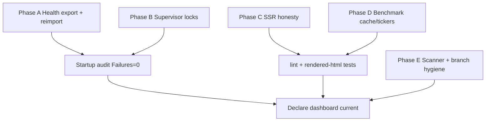

# Implementation Plan — RCA Remediation (2026-08-09)

Master plan to implement every proposed solution from `RCAs/RCA-2026-08-09-Investment-Dashboard.md`.  
Do **not** treat the dashboard as fully current until Phase A acceptance passes.

---

## Priority board

| Priority | Action | Owner surface | Dependency | Acceptance test |
|---|---|---|---|---|
| P0/P1-A | Ingest Health export eligible ≥ operational target | data / process | User Apple Health export after eligible window | Startup audit Failures=0; `/_health/snapshot` status=live |
| P1-B | Stabilize supervisor PID/port ownership | infrastructure | Local launchd/TCC | One Flask + one Vinext; pidfile matches; no EADDRINUSE for 30 min |
| P2-A | Fix SSR health/kite first paint | code / UX | None | SSR footer never shows fabricated `2026-07-16` |
| P2-B | Harden S-3 factor benchmark fetch/cache | integration | NSE/Yahoo | 7 series live **or** explicit cached/unavailable per index |
| P3-A | Improve RCA section scanner | tooling | None | Inventory lists S-1..S-3 |
| P3-B | Optional mirroring overrides for Nutrition gaps | process | iPhone Mirroring | Overrides present for target day when export incomplete |

---

## Phase A — Restore Health live through operational target

### A1. Confirm target policy at execution time

```bash
/usr/bin/python3 scripts/health_date_policy.py
```

Record `targetDate` / `targetPolicy`. On 2026-08-09 after 02:00 IST, expect `D_MINUS_1` → **2026-08-08**.

### A2. Produce a new Apple Health export

1. On iPhone: Health → profile → Export All Health Data.
2. Wait until export completes; place/replace ZIP in the configured iCloud Health folder (`…/Mobile Documents/com~apple~CloudDocs/Health/`).
3. Timing rule (critical): capture time must map `health_target_context(export_captured_at).target_date ≥` current operational target.  
   - Prefer export **after 20:00 IST** on the completed day, or any time on the following calendar day after 02:00 IST when D-1 is that completed day.
4. Do **not** delete the last validated `apple_health_export/export.xml` until the new ZIP validates (`apple_health_export/export.xml` present).

### A3. Re-import atomically

```bash
scripts/refresh-apple-health.sh
# or full:
DASHBOARD_PUBLIC_URL=http://127.0.0.1:5050 scripts/refresh-dashboard-data.sh
```

### A4. Optional mirroring bridge (Nutrition / Livity / Lifesum / Guava)

If export still lacks Nutrition completeness for the target day:

1. Use Computer Use / iPhone Mirroring to read exact values for the operational target only.
2. Write into `artifacts/private/health-overrides.json` for that date key (existing schema).
3. Re-run import so sources flip from Unavailable → Verified where appropriate.

### A5. Acceptance

| Check | Pass criteria |
|---|---|
| `GET /_health/snapshot` | `status=live`, `dataDate` ≥ `requiredThrough` |
| `artifacts/private/startup-audit.json` | `failures=0` |
| Health tab badge | not STALE |
| Footer (after hydrate) | HealthKit through target day · live |

### A6. Code follow-ups (optional hardening — only if product agrees)

| Change | Why | File |
|---|---|---|
| Log `exportCapturedAt` policy explicitly in snapshot message | Faster RCA next time | `import_apple_health.py` |
| Document export timing in README/AGENTS | Prevent overnight-export trap | `README.md` / `AGENTS.md` |
| Consider eligibility based on last complete category day **and** export timestamp | Product decision — do not silently loosen stale rules | policy discussion |

---

## Phase B — Runtime supervisor hardening

### B1. Symptoms to eliminate

- `Upstream down; restarting Vinext` storms  
- `EADDRINUSE 127.0.0.1:3000`  
- Vinext `ENOENT` for hashed `/assets/*` mid-restart  
- `service.pid` ≠ live supervisor PID  
- launchd `Operation not permitted`

### B2. Implementation steps

1. **Atomic pidfile**  
   - Write supervisor PID at start (`$$`) via temp+rename.  
   - On start, if pidfile alive and is `run-dashboard-service.sh`, refuse duplicate or adopt it.

2. **Listen-owner check before restart**  
   - Resolve PID listening on Vinext port via `lsof`.  
   - Restart only if: curl fails **and** (no listener **or** listener is the tracked `VINEXT_PID` / its process group).  
   - If an unexpected healthy listener exists, adopt PID (already partially coded for orphan case) and **do not** spawn a second Vinext.

3. **Rebuild drain**  
   - Before `npm run start` replacement, wait for `/` 200 **and** referenced CSS/JS 200.  
   - Or serve only from completed `dist/` generation with a generation stamp.

4. **Content-digest ensure**  
   - If `:3003` occupied but `/health` fails: kill only known `content-digest-server.mjs` PIDs, then relaunch.  
   - Never exit 1 in a tight supervisor loop without backoff (add exponential backoff + log).

5. **Launchd / TCC**  
   - Re-install LaunchAgent with Full Disk Access / Automation as required for project path.  
   - Confirm `launchd.err.log` no longer streams `Operation not permitted`.

6. **Health import concurrency**  
   - Keep single-flight lock (already waits); ensure SIGTERM during audit does not leave sqlite WAL dirty — verify post-kill snapshot still readable.

### B3. Acceptance

```bash
# clean restart via canonical script
npm run flask:service   # or scripts/run-dashboard-service.sh
cat ~/Library/Logs/PortfolioIntelligence/service.pid   # matches pgrep
lsof -nP -iTCP:5050,3000,3003 -sTCP:LISTEN            # exactly one each
# soak
# 30 minutes: grep -c EADDRINUSE vinext.log incremental == 0
```

---

## Phase C — SSR / first-paint freshness honesty

### C1. Problem

`fallbackHealth.dataDate = "2026-07-16"` paints a fabricated as-of date before client refresh.

### C2. Implementation options (pick one)

**Option 1 (preferred):** Server component / route loader reads `artifacts/private/health-snapshot.json` (and kite empty state) for initial props.  
**Option 2:** Change fallback to `status: "unavailable"`, `dataDate: ""`, message `"Loading validated Health snapshot…"`.  
**Option 3:** Omit date from footer while `refreshing === true`.

### C3. Files

- `app/dashboard/utils.ts` — `fallbackHealth`  
- `app/page.tsx` — initial state / refreshing footer copy  
- Mirror pattern for Kite empty SSR if desired

### C4. Tests

- Extend `tests/rendered-html.test.mjs` to assert footer does **not** contain `2026-07-16` when a newer snapshot exists, or asserts Loading copy when refreshing.  
- Keep Incognito gating tests intact.

### C5. Acceptance

View-source of `http://127.0.0.1:5050/` never shows July 16 once fixed; either real snapshot date or explicit loading/unavailable.

---

## Phase D — S-3 benchmark partial → resilient live/cache

### D1. Observed failures

| Index | Failure |
|---|---|
| NIFTY Alpha 50 | NSE 503; Yahoo 1 close |
| NIFTY200 Alpha 30 | NSE 503; no Yahoo ticker |
| NIFTY100 Low Volatility 30 | NSE 503; Yahoo 1 close |

### D2. Implementation steps

1. Inspect `scripts/fetch-sector-benchmarks-yfinance.py` ticker map; add exact Yahoo symbols where known.  
2. Add NSE fetch retries with browser-like headers / session warmup; respect 503 with backoff.  
3. Persist last-good daily series under `artifacts/private/` with `freshness=cached` + `asOf`.  
4. API: keep top-level `partial` when any index cached/unavailable; never blank the four healthy indices.  
5. UI: per-index empty/cached chip in Decision Lab (no silent zeros).

### D3. Acceptance

- Re-fetch: either histories length ≫ 1 for all seven, **or** clear cached/unavailable labels.  
- Audit still accepts `live|partial`.  
- S-3 pages render without throwing on missing series.

---

## Phase E — Tooling & hygiene

1. Update RCA `scan_dashboard.py` to resolve `SECTION_META.*.number` so S-2/S-3 appear.  
2. After code changes: `npm run lint`, `npm run build`, `node --test tests/rendered-html.test.mjs tests/freshness-and-isolation.test.mjs`.  
3. Merge hygiene: reconcile local `main` (ahead 1 / behind 2) with `origin/main` before release; keep `Visual-Overhaul` intentional.  
4. Re-run full startup refresh; inspect `startup-refresh.log`.  
5. Manual UI checklist from AGENTS.md (S-2 isolation, M-3 unfiltered, H Incognito).

---

## Execution order (recommended)



1. **A** (unblocks “complete dashboard” contract) — can be done without code.  
2. **B** in parallel if restarts are active.  
3. **C** and **D** as code PRs on `Visual-Overhaul`.  
4. **E** last.

---

## Verification script (post-fix)

```bash
export PATH="/opt/homebrew/bin:/usr/bin:/bin"
BASE=http://127.0.0.1:5050
curl -sf "$BASE/_flask/health" | tee /tmp/v-flask.json
curl -sf "$BASE/api/kite/snapshot" | python3 -c 'import sys,json;d=json.load(sys.stdin);assert d["status"]=="live"'
curl -sf "$BASE/api/earnings/snapshot" | python3 -c 'import sys,json;d=json.load(sys.stdin);assert d["status"]=="verified"'
curl -sf "$BASE/_health/snapshot" | python3 -c 'import sys,json;d=json.load(sys.stdin);assert d["status"]=="live", d'
curl -sf "$BASE/api/sectors/benchmarks" | python3 -c 'import sys,json;d=json.load(sys.stdin);assert d["status"] in ("live","partial")'
DASHBOARD_PUBLIC_URL=$BASE scripts/refresh-dashboard-data.sh | tee ~/Library/Logs/PortfolioIntelligence/startup-refresh.log
# Failures must be 0
```

---

## Out of scope for this plan

- Placing Kite orders  
- Fabricating Health/Nutrition values  
- Changing operational Health date policy without explicit product approval  
- Force-push / destructive git operations  
