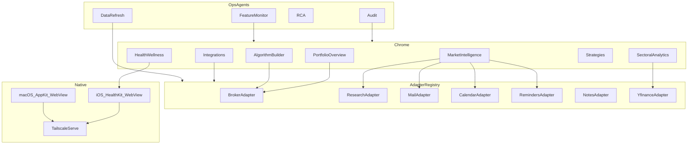

# STRATJI — Gap Inventory and Implementation Plan

> Generated against checkout `main` (workspace `/workspace`) on 2026-08-17.
> Target: [STRATJI-Customizable-On-Device-Platform-Prompt.md](STRATJI-Customizable-On-Device-Platform-Prompt.md)
> As-built authority: [AGENTS.md](../AGENTS.md)
>
> This plan implements **everything missing**. It does not re-implement Kite snapshot, Mail JXA, yfinance sector scripts, Flask, Tailscale Serve, HealthKit pairing, or the four existing analytical workspaces unless a change is required for adapters, rename, or isolation.

---

## 0. How to read this plan

Each item is tagged:

| Tag | Meaning |
|---|---|
| **MISSING** | Not in this tree |
| **PARTIAL** | Present but hardcoded, incomplete, or wrong vs target |
| **SHIPPED** | Present and reusable |
| **MERGE** | Missing here but likely present on `origin/Algo-Builder+Strategy`, `origin/Algorithm-Builder`, `origin/Visual-Overhaul`, or `origin/pr/algorithm-canvas-strategies` — port before rewriting |
| **REJECT** | Requested in the vision list but out of scope (no Stratji job or no public API) |

Do not start greenfield work for a **MERGE** item until `git log` / `git ls-tree` on that branch proves it is absent.

---

## 1. Exact gap inventory

### 1.1 Workspaces and chrome

| Item | Status | Evidence on `main` | Target |
|---|---|---|---|
| Portfolio Overview nav label | **PARTIAL** | `workspaces[0].label = "Investment"` in `app/dashboard/utils.ts`; iOS title `"Investment"`; PWA shortcut `"Investment"` | Rename visible label only; keep `?view=investment` |
| Four workspaces I/S/M/H | **SHIPPED** | `WorkspaceKey` union of four keys | Keep |
| Algorithm Builder / Canvas | **MISSING / MERGE** | No `BuilderWorkspace.tsx`, no `?view=builder` | Sixth workspace B-1/B-2/B-3 |
| Strategies | **MISSING / MERGE** | No `StrategiesWorkspace.tsx`, no `?view=strategies` | Y-1/Y-2 library |
| Integrations page | **MISSING** | No `?view=integrations`, no settings workspace | Pipeline console + guides |
| S-1 Action Board in Sectors | **PARTIAL** | Sectors workspace starts at S-2 (`SectorWorkspaceSection = "s2"\|"s3"\|"s4"`) | Add S-1 kanban like other workspaces |
| Earnings location | **PARTIAL** | S-4 lives in Sectoral Analytics; MI also shows earnings feeds | Move sole complete calendar to M-3; Sectors lose S-4 |
| Health 2×2 H-1..H-4 | **SHIPPED** | `HealthWorkspace.tsx` | Keep; do not drop H-4 while console is 2×2 |
| DailyKanbanBoard | **SHIPPED** | `shared-ui.tsx` | Extend `KanbanWorkspace` to builder/strategies |
| S-2 isolation | **SHIPPED** | tests in `tests/freshness-and-isolation.test.mjs` | Keep; expand tests after earnings move |

### 1.2 Pipelines and integrations

| Pipeline | Status | What exists | What is missing |
|---|---|---|---|
| Broker Kite read | **SHIPPED** | `app/kite-live-server.ts`, `/api/kite/snapshot`, `/api/kite/login`, Go MCP launcher | — |
| Broker Kite write | **MISSING / MERGE** | MCP prototype has `kite_place_order`; **no** `app/api/kite/order|gtt|alert`; no `KiteOrderTicket.tsx` | Tickets + routes + typed confirmation |
| Broker abstraction | **MISSING** | Kite hardcoded | `BrokerAdapter` interface, registry, Integrations card |
| Grow / other brokers | **MISSING / REJECT-if-no-API** | — | Honest `unavailable` card; optional CSV import as `cached` |
| Newsletters | **PARTIAL** | JXA `exactMailbox(account, "Newsletters")` | Configurable account/mailbox; extra mailboxes |
| Axis research | **PARTIAL** | Hardcoded `Axis Research` + `axis-mail-filter.mjs` + `axis-recommendations.mjs` | Provider registry; keep Axis as adapter 1 |
| HDFC / SBI / ET-Prime / Moneycontrol research | **MISSING** | — | Mailbox/PDF adapters; no site scraping |
| Apple Calendar | **PARTIAL** | Full Calendar.sqlitedb read | Configurable earnings calendar name; M-3/M-4 split |
| Apple Reminders | **PARTIAL** | Lists `Job 🔍` / `🔍Job` / `Earnings`; EventKit complete | Configurable lists |
| Google Tasks | **MISSING** | — | On-device OAuth adapter or `unavailable` |
| Apple Notes | **PARTIAL** | Exact ` Health Daily` | User note picker; stop using note as Health KPI source |
| Obsidian | **MISSING** | — | Vault path adapter |
| Notion | **MISSING** | `notion/` is project notes, not an API client | Notion MCP / official SDK adapter |
| OneNote | **MISSING** | — | Graph adapter or `unavailable` |
| yfinance sectors | **SHIPPED** | `fetch-sector-quotes-yfinance.py`, `fetch-sector-benchmarks-yfinance.py`, sector APIs | Configurable sector set later |
| yfinance generic quotes | **MISSING / MERGE** | No `app/api/quotes/yfinance` | CMP fallback route |
| Sector news RSS | **MISSING / MERGE** | No `app/api/sectors/news` | News server + route |
| Health ZIP + HealthKit | **SHIPPED** | `import_apple_health.py`, `/_health/snapshot`, iOS `HealthKitSync.swift` | — |
| Health Shortcut overrides | **MISSING / MERGE** | No `import_health_shortcut.py` | Optional overrides JSON |
| Podcasts | **PARTIAL** | SQLite + TTML | Optional Ollama summarizer (`PODCAST_SUMMARIZER_MODEL`) |
| Tailscale | **SHIPPED** | `scripts/start-remote-app.sh` | Integrations guide card |
| PDF | **SHIPPED** | `:3002` + `/api/report-pdf` | Pre-export refresh remains mandatory |
| Strategy persist | **MISSING / MERGE** | No `app/strategy/*`, no SQLite/Supabase store | Local SQLite default |
| Integrations registry | **MISSING** | No `artifacts/private/integrations.json` schema | CRUD API + example config |
| FII/DII / baked research | **PARTIAL** | `app/fii-dii-flows.ts`, `portfolio-data.ts`, `sector-data.ts` | Autonomous fetchers later; label `cached` |

### 1.3 Packages and libraries (npm / Python / Swift)

#### npm — present

`next@16.2.6`, `react@19.2.6`, `recharts`, `lucide-react`, `drizzle-orm` (unused schema), `vinext`, `vite`, `tailwindcss`, `typescript`, `eslint`

#### npm — missing vs target

| Package | Why |
|---|---|
| Workspace `packages/contracts` | `StrategyTreeV1` / `StrategyGraphV2` (**MERGE** if on algo branch) |
| Workspace `packages/kpi-registry` | 128-KPI catalog (**MERGE**) |
| `@modelcontextprotocol/sdk` | Only if a Node MCP client is added; Kite runtime is Go |
| `better-sqlite3` or `sql.js` | Local strategy + integrations store |
| `@supabase/supabase-js` | Optional; **not** required for v1 on-device |
| Google APIs client | Only if Google Tasks is implemented |
| `@notionhq/client` | Only if Notion adapter is HTTP rather than MCP |
| `zod` | Adapter config + ticket validation (if not already added on MERGE branches) |

Do **not** add: cloud BI SDKs, Slack/Teams, DriverKit wrappers, ARKit JS, LiveKit, HomeKit JS.

#### Python — present

`Flask`, `waitress`, `yfinance` in `requirements-flask.txt`

#### Python — missing vs target

| Package | Why |
|---|---|
| `pymupdf` (PyMuPDF) | Axis/research PDF text extract (**MERGE** if `extract-axis-pdf-recommendations.py` is ported) |
| Optional `google-api-python-client` | Google Tasks if Python-side |
| Optional `beautifulsoup4` | Only for local HTML mail bodies already on disk — not for scraping |

#### Swift / Xcode — present

SwiftUI iOS app; HealthKit entitlement; UIKit; WebKit; AppKit compile flag; Security keychain pairing

#### Swift — missing vs target

| Item | Why |
|---|---|
| Dedicated macOS app target / scheme that is not Chrome `--app` | Working Mac app |
| `DashboardWorkspace.builder` / `.strategies` / `.integrations` | Native nav |
| WidgetKit extension | Plus |
| ActivityKit / SiriKit intents | Plus |
| EventKit.framework in-app (Mac) | Today complete-reminder is a sidecar Swift script |
| CareKit/ResearchKit/GymKit/WorkoutKit | Later Health-only, not v1 |
| StoreKit, PencilKit, PaperKit, ReplayKit | Later |
| HomeKit, ARKit, DriverKit, LiveKit | **REJECT** |

### 1.4 Code files (web)

**MISSING / MERGE (Algorithm + Strategies)**

- `app/dashboard/BuilderWorkspace.tsx`
- `app/dashboard/builder/SymphonyEditor.tsx`
- `app/dashboard/builder/TreeCanvas.tsx`
- `app/dashboard/builder/AlgorithmBuilder.tsx`
- `app/dashboard/builder/AssetInstrumentPicker.tsx`
- `app/dashboard/builder/BuilderJsonPanel.tsx`
- `app/dashboard/builder/KpiRegistryPanel.tsx`
- `app/dashboard/builder/TreeBrokerConfirm.tsx`
- `app/dashboard/StrategiesWorkspace.tsx`
- `app/dashboard/strategies/ReadOnlyTree.tsx`
- `app/dashboard/workspace-routing.ts` (canonical parsers)
- `app/dashboard/KiteOrderTicket.tsx`, `KiteGttTicket.tsx`, `KiteAlertTicket.tsx`
- `app/dashboard/visual-components.tsx` (if PulseConstellation lives only inline today)
- `app/strategy/**` (tree-live, tree-evaluate, persist, composer-strategies, …)
- `packages/contracts/**`, `packages/kpi-registry/**`
- `app/api/kite/order/route.ts`, `gtt/route.ts`, `alert/route.ts`, `instruments/route.ts`
- `app/api/quotes/yfinance/route.ts`
- `app/api/sectors/news/route.ts`
- `app/api/strategies/**`, `app/api/backtests/**`
- Tests: `tests/algorithm-*.test.mjs`, `tests/strategies-*.test.mjs`, `tests/strategy-*.test.mjs`

**MISSING (Integrations + adapters — greenfield)**

- `app/dashboard/IntegrationsWorkspace.tsx`
- `app/dashboard/integrations/PipelineCard.tsx`
- `app/dashboard/integrations/GuideArticle.tsx`
- `app/integrations/registry.ts`
- `app/integrations/schema.ts` (zod)
- `app/integrations/broker/types.ts`
- `app/integrations/broker/kite.ts`
- `app/integrations/broker/unavailable.ts` (Grow stub)
- `app/integrations/research/types.ts`
- `app/integrations/research/axis.ts` (wrap existing scripts)
- `app/integrations/research/generic-mailbox.ts`
- `app/integrations/mail/newsletters.ts`
- `app/integrations/calendar/config.ts`
- `app/integrations/reminders/config.ts`
- `app/integrations/tasks/google.ts`
- `app/integrations/notes/apple.ts`
- `app/integrations/notes/obsidian.ts`
- `app/integrations/notes/notion.ts`
- `app/integrations/notes/onenote.ts`
- `app/api/integrations/route.ts`
- `app/api/integrations/[id]/test/route.ts`
- `config/integrations.example.json`
- `scripts/integrations-validate.mjs`

**PARTIAL (must edit)**

- `app/dashboard/types.ts` — extend `WorkspaceKey`
- `app/dashboard/utils.ts` — nav labels, kanban keys
- `app/page.tsx` — routing, Integrations, builder, strategies
- `app/dashboard/shared-ui.tsx` — tabs
- `app/dashboard/SectorsWorkspace.tsx` — add S-1; remove S-4 after M-3
- `app/dashboard/IntelligenceWorkspace.tsx` — M-1..M-4 structure; configurable sources
- `scripts/content-digest-server.mjs` — replace mailbox/list literals with config
- `scripts/refresh-dashboard-data.sh` — iterate configured sectors/providers
- `AGENTS.md` — six workspaces, Portfolio Overview, Integrations, agents
- `README.md`, `public/manifest.webmanifest`, `apple-app/README.md`

### 1.5 Code files (iOS + macOS)

| File | Status | Work |
|---|---|---|
| `apple-app/InvestmentDashboard/PortfolioDashboardConfiguration.swift` | **PARTIAL** | Add workspaces; rename Investment title |
| `apple-app/InvestmentDashboard/ContentView.swift` | **PARTIAL** | Nav for new workspaces |
| `apple-app/InvestmentDashboard/DashboardShellViews.swift` | **PARTIAL** | Settings → Integrations deep link; Tailscale guide |
| `apple-app/InvestmentDashboard/DashboardBrowser.swift` | **PARTIAL** | Already has AppKit flag; host Mac scene |
| `apple-app/InvestmentDashboard/HealthKitSync.swift` | **SHIPPED** | Keep |
| `apple-app/InvestmentDashboard/HealthPairing.swift` | **SHIPPED** | Keep |
| `apple-app/InvestmentDashboard.xcodeproj` | **PARTIAL** | Add macOS target/scheme; WidgetKit later |
| `apple-app/InvestmentDashboardTests/*` | **PARTIAL** | URL cases for builder/strategies/integrations |
| New: `apple-app/InvestmentDashboard/MacApp.swift` or multiplatform `App` scene | **MISSING** | Native Mac window, service supervisor hook |
| New: `scripts/complete-reminder-eventkit.swift` | **SHIPPED** | Keep; later in-app EventKit |
| Chrome Dock wrapper `scripts/install-desktop-app.sh` | **PARTIAL** | Point at native Mac app once it exists |

### 1.6 APIs / MCPs / Skills / Agents

| Kind | Present | Missing |
|---|---|---|
| HTTP APIs | kite snapshot/login, content, earnings, sectors snapshot/benchmarks, dashboard refresh/freshness, report-pdf, health, install | order/gtt/alert/instruments, yfinance quotes, sector news, integrations CRUD/test, strategies/backtests |
| MCP runtime | Kite Go adjacent | User MCP registry UI; Notion MCP wiring |
| MCP in-repo TS | Prototype only | Do not promote to runtime |
| Skills in this repo | None | `stratji-audit`, `stratji-rca`, `stratji-feature-monitor`, `stratji-data-refresh`, `stratji-integrations-onboard`, semantic-layer copy |
| Agents in this repo | None | `agents/stratji-audit.md`, `agents/stratji-rca.md`, `agents/stratji-feature-monitor.md`, `agents/stratji-data-refresh.md` |
| `.cursor/` plugin | None | Plugin manifest pointing at agents + skills |
| Codex skills on owner Mac | Exist outside repo (`~/.codex/skills/rca`, `refresh-investment-dashboard`) | Vendor copies into `.codex/` or `.cursor/skills/` inside the repo so Stratji is portable |

### 1.7 Apple Kits — decision table

| Kit | Decision |
|---|---|
| HealthKit, UIKit, WebKit, AppKit, EventKit (helper) | Implement / extend |
| WidgetKit, ActivityKit, SiriKit | Phase 6 (Plus) |
| CloudKit | Reject for secrets; optional later for non-secret prefs |
| CareKit, ResearchKit, GymKit, WorkoutKit, EnergyKit | Phase 7 research, only if they map to H-4 without replacing HealthKit |
| StoreKit, PencilKit, PaperKit, ReplayKit | Phase 7 productization |
| HomeKit, ARKit, DriverKit, LiveKit | **REJECT** — no files, no stubs |

---

## 2. Architecture to implement



Config file (gitignored live, example committed):

```json
{
  "broker": { "id": "kite", "mcpUrl": "http://127.0.0.1:8080/mcp" },
  "newsletters": [{ "account": "iCloud", "mailbox": "Newsletters" }],
  "research": [{ "id": "axis", "account": "iCloud", "mailbox": "Axis Research", "pdfDir": "~/Downloads/Axis Research" }],
  "calendars": { "earningsName": "Earnings", "include": ["*"] },
  "reminders": { "lists": ["Job 🔍", "Earnings"] },
  "notes": { "apple": [], "obsidianVault": null, "notion": null },
  "sectors": ["pharma", "power", "infrastructure", "auto", "telecom", "banking", "nbfc", "fmcg", "consumer", "energy", "defence"],
  "googleTasks": { "enabled": false }
}
```

---

## 3. Phased implementation

Work serially where files collide (`app/page.tsx`, `types.ts`, `AGENTS.md`). Parallelize disjoint adapter packages after Phase 0 routing types exist.

### Phase 0 — Contract, rename, routing skeleton

**Goal:** Portfolio Overview label; `WorkspaceKey` includes `builder | strategies | integrations`; tabs render even if panels are placeholders that say `missing` is forbidden — panels must be real empty states with kanban for analytical workspaces.

**Files:** `app/dashboard/types.ts`, `utils.ts`, `shared-ui.tsx`, `page.tsx`, `public/manifest.webmanifest`, `PortfolioDashboardConfiguration.swift`, tests, `AGENTS.md`.

**Acceptance:** `?view=investment` shows nav **Portfolio Overview**. Unknown views still default to investment. iOS tests updated. No route break.

### Phase 1 — MERGE Algorithm Builder + Strategies + Kite writes

**Goal:** Port from algo/visual-overhaul branches: tree DSL, canvas, library, live preview, backtest, Kite tickets, quotes yfinance, sector news if present.

**Steps:**

1. `git fetch origin Algo-Builder+Strategy Visual-Overhaul Algorithm-Builder`
2. Diff those trees against `main` for `app/strategy`, `app/dashboard/builder`, `packages/`, kite tickets, APIs.
3. Port with conflict resolution favoring `main` Health/MI isolation tests.
4. Wire `KanbanWorkspace` for builder/strategies.
5. Add npm workspace packages if the branch uses them; otherwise copy into `packages/`.

**Acceptance:** `?view=builder&section=canvas` edits a tree; `?view=strategies&section=y2` lists reconstructions; order ticket cannot submit without confirmation; no live order in tests.

**Risk:** Large merge. If port is unsafe, implement a minimal B-1 kanban + B-2 JSON import of `StrategyTreeV1` first, then canvas.

### Phase 2 — Earnings ownership + S-1 + MI M-1..M-4

**Goal:** Align layout with the prompt without losing earnings.

**Files:** `SectorsWorkspace.tsx`, `IntelligenceWorkspace.tsx`, `EarningsMonthCalendar.tsx`, isolation tests, `AGENTS.md`.

**Steps:**

1. Add S-1 `DailyKanbanBoard` to Sectors.
2. Introduce MI sections M-1..M-4 if not already numbered.
3. Move the complete earnings workbench to M-3.
4. Strip S-4 from Sectors; keep URL alias `?view=sectors&section=s4` → redirect to `?view=intelligence&section=m3`.
5. M-4 excludes earnings calendar rows.
6. Update `tests/rendered-html.test.mjs` and `tests/freshness-and-isolation.test.mjs`.

**Acceptance:** Zero earnings grids in Sectors. MI unfiltered. S-2 dimming only in S-2.

### Phase 3 — Integration registry + configurable Apple sources

**Goal:** Delete string literals for mailboxes/lists from `content-digest-server.mjs` in favor of `integrations.json`.

**Files:** schema, example config, `GET/PUT /api/integrations`, `POST /api/integrations/:id/test`, digest server, refresh script, `IntegrationsWorkspace.tsx`.

**Steps:**

1. Load config with defaults identical to today’s hardcoded values so a missing file does not break Aditya’s Mac.
2. Newsletter + Axis + reminder lists + earnings calendar name read from config.
3. Test-connection: JXA mailbox exists; Reminders list exists; Kite MCP health; yfinance one quote; Health snapshot date.
4. UI pipeline cards with status pills.
5. Step-by-step markdown rendered from `app/integrations/guides/*.md`.

**Acceptance:** Changing mailbox in Integrations and saving causes the next content refresh to use it. Invalid mailbox → `permission_required` or `unavailable`, last snapshot retained.

### Phase 4 — Research multi-provider + notes/tasks adapters

**Order:** Axis wrap → generic mailbox/PDF provider → Obsidian → Notion MCP → Google Tasks → OneNote.

**Rules:** No paywall scraping. HDFC/SBI/ET-Prime/Moneycontrol start as mailbox+PDF adapters using the generic parser (subject/body bullets, optional PDF text via pymupdf). I-4 becomes provider-filterable.

**Acceptance:** Two research providers can be enabled; I-4 does not assume Axis-only titles. Obsidian vault lists `.md` files without uploading them. Unconfigured Google Tasks card is `unavailable`.

### Phase 5 — Broker adapter + Grow honesty

**Files:** `app/integrations/broker/*`, Investment I-2 tickets bound to active adapter, Builder confirm bound to adapter.

**Grow:** If no public API at implementation time, card text states that. Optional CSV holdings import stored as `cached` snapshot, never `live`.

**Acceptance:** Switching broker id without a working adapter cannot show `live`. Kite remains default.

### Phase 6 — Native Mac app + iOS workspace parity

**iOS:** add workspace enums; deep link `?view=`; settings row opens Integrations.

**macOS:** multiplatform target; window hosts `WKWebView`; menu: Refresh (dispatch `portfolio-native-refresh`), Report, Integrations. `install-desktop-app.sh` launches this app. Keep launchd service as the data plane.

**Plus (separate PR):** WidgetKit freshness widget; SiriKit “Refresh Stratji”; ActivityKit session timer.

**Acceptance:** iOS can open all six workspaces + Integrations. Mac app loads `http://127.0.0.1:5050/` without Chrome. HealthKit still iOS-only.

### Phase 7 — Ops plugin: Skills + four Agents

**Repo paths:**

```
.cursor/agents/stratji-audit.md
.cursor/agents/stratji-rca.md
.cursor/agents/stratji-feature-monitor.md
.cursor/agents/stratji-data-refresh.md
.cursor/skills/stratji-audit/SKILL.md
.cursor/skills/stratji-rca/SKILL.md
.cursor/skills/stratji-feature-monitor/SKILL.md
.cursor/skills/stratji-data-refresh/SKILL.md
.cursor/skills/stratji-integrations-onboard/SKILL.md
.cursor/skills/stratji-semantic-layer/SKILL.md
```

Copy RCA report template and refresh coverage contract from `~/.codex/skills/` where they exist, then trim paths to be repo-relative.

**Acceptance:** Feature Monitoring run produces `artifacts/audits/<date>/feature-monitor.md` whose matrix matches this plan. Audit/RCA/Refresh agent files include tools, forbidden actions, artifacts, and handoffs from the system prompt.

### Phase 8 — Hardening

- Expand `refresh-dashboard-data.sh` to configured sectors and providers.
- Add `tests/integrations-registry.test.mjs`.
- Add `tests/workspace-routing.test.mjs` for six views + aliases.
- Update `scripts/refresh-dashboard-data.sh` sector news/benchmarks rows if those APIs ship (`live` or `partial` as allowed).
- PDF pre-export still refreshes Kite, Mail, earnings, all sectors.
- Sanitize guides: no secrets in screenshots.
- Reject kit stubs: grep CI that `ARKit|DriverKit|HomeKit|LiveKit` do not appear in app sources.

---

## 4. Suggested package.json / Python additions (v1)

**npm (required for Phases 1–3):**

- workspace packages `packages/contracts`, `packages/kpi-registry` (or merge)
- `zod` for config/tickets
- `better-sqlite3` for local strategy library if not using JSON files

**npm (optional later):** `@supabase/supabase-js`, `@notionhq/client`, `googleapis`

**Python:** `pymupdf` when PDF extract is ported

**Do not add** to v1: LiveKit, AR SDKs, HomeKit, cloud warehouse clients.

---

## 5. Test and verification matrix

| After phase | Commands |
|---|---|
| 0 | `npm run lint`, `node --test tests/rendered-html.test.mjs`, iOS unit tests for titles |
| 1 | algo/strategy tests from MERGE + kite ticket tests (no network order) |
| 2 | `tests/freshness-and-isolation.test.mjs`, rendered-html M-3/S-4 assertions |
| 3 | integrations registry tests; digest server unit test with fixture config |
| 4 | I-4 provider grouping test; obsidian path traversal guard test |
| 5 | BrokerAdapter fake: snapshot `cached` cannot render as live |
| 6 | Swift tests for all `DashboardWorkspace` URLs; Mac target compiles |
| 7 | Agents exist; feature-monitor script can run in CI without Apple TCC |
| Any MI/Sectors change | `npm run lint`, `npm run build`, `node --test tests/rendered-html.test.mjs` |

Manual (Mac): Flask up → `scripts/refresh-dashboard-data.sh` → localhost + Tailscale → S-2 isolation → Health incognito → no live order without typing confirmation.

---

## 6. Explicit non-goals (still listed so Feature Monitoring can mark REJECT)

1. Unofficial Grow/HDFC/Upstox private API reverse engineering.
2. Scraping ET Prime / Moneycontrol logged-in HTML.
3. Multi-tenant hosting of Mail, Health, or Kite tokens.
4. DriverKit, ARKit, HomeKit, LiveKit features.
5. Replacing HealthKit with Apple Notes.
6. Silently restoring completed Reminders.
7. Changing `?view=investment` to `?view=portfolio-overview` in v1.
8. Black-box third-party strategy marketplace.

---

## 7. Execution order for the next coding agent

1. Do not implement adapters in the same PR as the prompt docs if the user only asked for plans — **this repo change is documentation**. Implementation PRs follow this sequence:
2. Phase 0 rename + routing (small, safe).
3. Phase 1 MERGE inventory (`git ls-tree -r origin/Algo-Builder+Strategy --name-only | rg 'strategy|builder|kpi-registry'`) then port.
4. Phase 2 earnings move (AGENTS.md + tests together).
5. Phase 3 Integrations (unblocks user-customizable claim).
6. Phase 4–5 adapters.
7. Phase 6 native.
8. Phase 7 agents (can start in parallel after Phase 0 because they are markdown + skills; update matrix as features land).

---

## 8. Definition of done (product)

Stratji is done for this prompt when Feature Monitoring reports `shipped` for:

- Six analytical workspaces + Integrations chrome
- Portfolio Overview label
- Configurable Mail / research / reminders / calendars
- Kite adapter with confirmed writes
- yfinance free path labelled `public_delayed` when used as fallback
- Native iOS all workspaces + native Mac app (not Chrome Dock as primary)
- Four ops agents in-repo with artifacts
- `AGENTS.md` matches shipped behavior
- Startup audit still semantic, still no persistent failure banner
