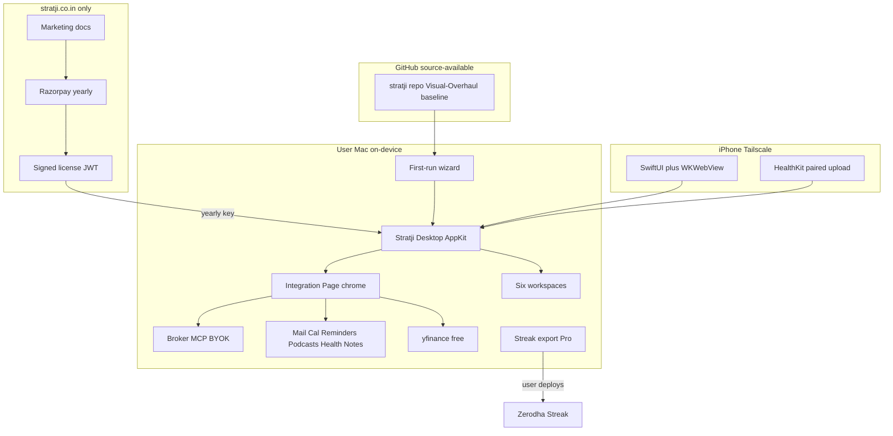

# Stratji Publish-Ready Master Plan

This is the **living product + engineering bible** for Stratji. Agents and humans must treat it as the source of truth for install, customize, integrate, and ship work.

**Companion prompt:** [STRATJI-Platform-Master-Prompt.md](STRATJI-Platform-Master-Prompt.md)  
**Historical inventory (4-workspace as-built, do not execute as current law):** [STRATJI-Master-System-Prompt.md](STRATJI-Master-System-Prompt.md)  
**Live operating law until AGENTS.md is rewritten in P1:** repository `AGENTS.md`

**Baseline:** Visual-Overhaul / APPKIT HEAD of the Investment Dashboard repo.  
**Brand:** Stratji (product). In-code chrome may still say Portfolio Intelligence until P1 rename completes.  
**Legal posture (INVARIANT):** Stratji is **software tooling**, not investment advice, not a SEBI Research Analyst product, not a black-box algo marketplace. White-box user-authored strategies only.

---

## 0. Fidelity labels

Use these in every doc, PR, and agent instruction:

| Label | Meaning |
| --- | --- |
| **AS-BUILT** | Exists on Visual-Overhaul / current HEAD today. |
| **TARGET** | Required for any-user install / customize / integrate / Pro Streak. |
| **INVARIANT** | Must survive both states. Violating it is a regression even if the UI looks fine. |

---

## 1. Locked product decisions (INVARIANT)

- On-device **macOS data plane only**. iPhone is a private **Tailscale** client, never a second data plane.
- GitHub **source-available** plus paid yearly licenses on [stratji.co.in](https://www.stratji.co.in): Basic ₹5,000 / Plus ₹9,999 / Pro ₹19,999.
- Cloud holds **only** marketing + license issuance. Never Mail, Health, broker tokens, notes, or Kite credentials.
- Live strategy execution **only via Zerodha Streak**. Stratji exports a white-box recipe + approval checklist. The user deploys and confirms in Streak. Stratji core **never** silently auto-trades.
- **yfinance is free for all**. Paid Kite market-data is optional and **never required** for Sectoral Analytics.
- Workspace 1 nav/chrome label: **Portfolio Overview**. Canonical URL stays `?view=investment`. Aliases: `portfolio`, `portfolio-overview`.
- **Integration Page is chrome, not a 7th workspace.** Route `?view=integrations` (alias `settings`). No `DailyKanbanBoard`, no industry filters, no earnings, no Health on that page.
- Six workspaces stay separate. `DailyKanbanBoard` is the only action board. S-2 filter isolation, M-3 sole earnings calendar, S-3 local selector, Health non-scrolling console + incognito + operational date policy — all INVARIANT (`AGENTS.md`).
- Exhaustive TypeScript switches with `never` default. Imports at top of file only.
- Do not fabricate live / Mail / Podcast / Health / earnings / backtest values.

---

## 2. User journeys

### 2A INSTALL (any Mac user)

**AS-BUILT:** clone repo, Node 22+, `npm install`, `npm run flask:setup`, `scripts/run-dashboard-service.sh`, `npm run desktop` historically opened Chrome `--app` around `localhost:5050`, launchd plist, personal paths and Tailscale hostname baked in.

**TARGET:**

- One installer (`scripts/install-stratji.sh` + notarized `.pkg` later) that installs Node/Python venv, kite-mcp (or user-supplied path), Flask/Waitress, launchd, Dock app named **Stratji**.
- Native **AppKit** desktop app owns WKWebView at `http://127.0.0.1:5050/` and starts/checks the local Flask service.
- First-run wizard on the Integration Page: license key (P1 later), broker keys, mailbox names, calendar/reminder lists, notes vault, Health ZIP folder, Tailscale optional.
- Sanitize: no `/Users/adityasharma/...` required at runtime; Aditya’s current Mac paths remain **seed defaults** so the personal dashboard does not regress.
- Entitlement: Basic/Plus/Pro from signed JWT; 7-day grace; secrets never leave the Mac. **Not in this slice.**
- Docs: [docs/stratji/INSTALL.md](../docs/stratji/INSTALL.md).

### 2B CUSTOMIZE + USE

**AS-BUILT:** Aditya-specific Axis mailbox, `Job 🔍` / `Earnings` lists, 11 hardcoded sectors, Nifty 500 builder universe, baked FII/DII and some narratives.

**TARGET:** every connector is a named adapter with `{ status, asOf, source, payload, lastValidated }`. User config conceptually in `~/Library/Application Support/Stratji/config.json`. v1 may use gitignored `artifacts/private/integrations-config.json`. Default seed can import Aditya’s current Mac. Disable unused workspaces (e.g. Health) without breaking others.

### 2C INTEGRATE

**TARGET Integration Page** (`?view=integrations`): pipeline cards, test-connection, disconnect, last-validated snapshot, copy-paste playbooks for API keys, MCP install, Skills, plugins, agents. Writes (orders, reminder complete, note create) need typed confirmation.

---

## 3. Requirements catalog

### 3A Functional (all six workspaces) — INVARIANT unless labelled TARGET

Preserve Visual-Overhaul surfaces exactly, then rename/extend:

- Six separate workspaces, collapsible state, URL `?view=investment|sectors|intelligence|health|builder|strategies`.
- Aliases: `market-intelligence`, `algorithm-canvas` (opens builder canvas), `strategy-library`. **TARGET** aliases: `portfolio`, `portfolio-overview`, `integrations`, `settings`.
- Every **workspace** uses the same three-lane `DailyKanbanBoard` (I-1 visual contract). No compact/single-lane variants. Integration Page is **not** a workspace and must not mount the board.
- S-2 industry filter never leaks. Market Intelligence always complete. M-3 sole earnings calendar. S-3 has its own selector.
- Health non-scrolling H-1/H-2/H-3 console; incognito; Body Measurements and Hearing excluded.
- Algorithm Builder: nested `StrategyTreeV1`, 128-KPI registry, Nifty 500, no `*BEES` sleeves, no fake RUN.
- Strategies library: Composer-logic reconstructions on NSE names; honest yfinance KPIs; US books never copied; edit only in Builder.

### 3B Non-functional — INVARIANT

- Freshness audit after Flask is reachable (`scripts/refresh-dashboard-data.sh`). Semantic statuses, not HTTP 200.
- Log: `~/Library/Logs/PortfolioIntelligence/startup-refresh.log` (**TARGET** also `.../Stratji/...` with a symlink).
- No persistent “startup audit failed” banner.
- Mac awake required for live Kite/Apple refresh.
- `prefers-reduced-motion`, keyboard nav, Dynamic Type on iPhone.

### 3C Distribution / commercial — TARGET

- Public GitHub, source-available commercial license.
- stratji.co.in: marketing, Razorpay yearly checkout, license portal, ToS/Privacy/disclaimer.
- Cloud holds **only** marketing + license issuance.

### 3D Compliance (Pro live) — TARGET for execution; white-box is INVARIANT

- White-box text of every strategy.
- Static IP attestation, OPS threshold guidance (typical retail ≤10), Algo-ID field, change log on logic edits.
- Execution venue = Zerodha Streak. No unofficial Streak scraping. No Stratji-core silent orders.

---

## 4. Gap analysis — Visual-Overhaul vs publish-ready

**Already a product-quality personal OS (AS-BUILT):** six workspaces, charts, KPIs, layouts, Kite tickets, Mail/Podcasts/Calendar/Reminders, HealthKit pairing, yfinance sectors, RSS news, PDF brief, Tailscale iPhone wrapper.

**Blocks any-user install:**

- Personal paths, Tailscale hostname, Axis-only mailboxes, hardcoded reminder lists.
- Empty `db/schema.ts`; prefs in `localStorage` (no Mac↔iPhone sync).
- No Integration Page historically; no Groww; no Google Tasks/Calendar; no Obsidian/Notion/OneNote adapters.
- Builder backtest often `ran: false`; no Streak export; no license gate.
- Desktop app was a Chrome `--app` wrapper (this slice adds a real AppKit target).
- iOS app bundle `com.adityasharma.InvestmentDashboard`; apple-app README still has a stale S-4 paragraph — follow `AGENTS.md`.
- Agent-era baked data: FII/DII const, some sector narratives, earnings KPI rows without a live IR/NSE fetcher.

---

## 5. Phased development (P0–P7)

Do not collapse these. Each phase has a stop/ship gate.

| Phase | Name | Ship gate |
| --- | --- | --- |
| **P0** | Docs freeze | This bible + `docs/stratji/` + platform prompt exist. |
| **P1** | Sanitize + installer + wizard + license client (Basic) | Clean Mac completes wizard → Kite login → live holdings → S-2 yfinance. License client may land after wizard. |
| **P2** | Integration Page + adapter interface | All tiers see the page; connectors gated; local vault. |
| **P3** | Plus connectors | User-named Mail/Calendar/Reminders/Health succeed. |
| **P4** | Native Mac + iOS apps | AppKit Stratji owns local server; iOS remains Tailscale WKWebView. |
| **P5** | Algorithm Builder completeness (Pro alpha) | Honest backtest `ran: true` only when engine ran. |
| **P6** | Strategies + Streak (Pro) | Streak export checklist-complete; Stratji places **zero** unattended orders. |
| **P7** | GitHub public + paid launch | Closed Mac beta → public GitHub + Basic/Plus paid. |

**This slice implements:** P0 docs + P1 rename/wizard scaffolding + P2 Integration Page UI + P4 AppKit target scaffolding. It does **not** implement Razorpay, JWT license server, Groww live API, or Streak scraping.

Independence remediation (FII/DII fetcher, NSE earnings announcements, macro dials, launchd content refresh, optional Ollama summaries) rides along P1–P3.

---

## 6. Six workspaces — sections, charts, KPIs, layouts

Nav accents (AS-BUILT): Portfolio Overview blue `#2563eb`, Sectors teal, Intelligence purple, Health rose, Algorithm Canvas amber `#d97706`, Strategies lime `#65a30d`.

**Global layout (INVARIANT):** app shell `.dashboard-app` = `width: min(1480px, 100%)`, centered, `2px` left/right rules, safe-area padding. Brutalist: **zero radius**, **2px borders**, hard offset shadows (`4px 4px 0`). Headings Georgia; body Geist/mono. Appearances: Black / Dark / Sepia. Sticky workspace nav. Collapsibles persist in `localStorage` (`portfolio-section-v2-<num>-open`), default collapsed.

Canonical action board (all six **workspaces**): summary header + **To Do Today** / **Monitor** / **Completed Today**; click → strike-through Completed; local-day persist; midnight reset. Implementation: only `DailyKanbanBoard` in `app/dashboard/shared-ui.tsx`.

### 6A Portfolio Overview — `?view=investment` — AS-BUILT (label TARGET)

File: `app/dashboard/InvestmentWorkspace.tsx`. Key stays `investment`.

- **I-1 Action Board** — canonical Kanban.
- **I-2 Portfolio** — 70/30 analysis grid.
  - 4 `InstrumentGauge` cards: value, unrealised P&L, top-two concentration (redline ≥65%, warn ≥50%), available equity margin (redline if <5% of value).
  - Nested 4-ring Recharts donut (AMFI cap → industry → sub-sector → holdings); center unrealised + day P&L; day-negative segments shaded.
  - 2×2 management cards: overview, risk mitigation, Axis-linked upside, alpha actions.
  - Activity tabs: Holdings (transposed matrix + BUY/SELL tickets), Orders, Positions, GTTs, TSLs, Alerts.
  - Squarified treemap: size=weight, color=return tone, aspect 1.46:1.
- **I-3 Risk** — two-column `.investment-risk-grid`. Macro scenario lab (5 events × 3 bands); FII/DII donut + evidence; stacked horizontal risk bar (6 drivers 0–5); 6-axis holdings radar vs portfolio average.
- **I-4 Axis / research picks** — grouped analyst matrix + PDF workbench + progress-to-target meters + recommended risk radar. **TARGET:** house-agnostic “Research picks” fed by whatever research mailboxes the user linked.

**Portfolio KPIs:** invested, value, unrealised ₹/%, day ₹/%, top-two %, margin, per-holding Qty/Avg/Last/Value/U/Day/Weight, high-risk weight %, Axis coverage % and weighted upside. CMP order: kite → yfinance → research PDF. Never fabricate.

### 6B Sectoral Analytics — `?view=sectors` — AS-BUILT

S-1 board. **S-2 only** industry prism (multi-select; dim non-selected). Pages: pulse, companies, rankings, lifecycle, structure, mece.

- Pulse: shockwave matrix (sectors × Crude/USD-INR/Rates/Monsoon/AI capex/Q1 earnings glyphs ▲▼●—), pulse-orb KPI cards, news+sentiment 3 columns.
- Companies: breadth strip + table (price, 1D/1W/1M/3M, Growth/Profitability/Margin/Quality 1–5), 6/page.
- Rankings: Market vs Fundamentals; leaders/laggards duel.
- Lifecycle scatter: stage × expected growth × weight.
- Structure scatter: operating margin × profit-pool concentration; refs at 20% / 3.5.
- MECE loom: Demand / Profit pool / Policy / Valuation.

**S-3** local selector (must not read/write S-2): benchmarks line chart (≥2 closes), investability/PESTEL/Porter radars vs median + decision gate (Allocate/Monitor/Reassess/Avoid at 4 / 3.2 / 2.5), TriggerDials + distance-to-trigger and squeeze-width bars.

**11 sectors AS-BUILT:** Pharma, Power, Infrastructure, Auto, Telecom, Banking, NBFC, FMCG, Consumer, Energy, Defence. **TARGET:** user can add/remove sectors; yfinance remains the free market plane.

### 6C Market Intelligence — `?view=intelligence` — always unfiltered — INVARIANT

- **M-1** board.
- **M-2** Newsletters (sender collapsibles, Read Later, promo-stripped) + Research PDFs (one primary Open PDF) + Podcasts (`WaveformStrip`, transcript vs description honesty, dedupe by normalized title).
- **M-3** sole earnings month grid; Apple Calendar = scheduling evidence only; KPI slots blank until IR/NSE verified.
- **M-4** exactly one Calendar collapsible (non-earnings) + one Reminders collapsible (Completed / Scheduled Important / Work). Completed never silently restored.

### 6D Health & Wellness — `?view=health` — non-scrolling console — INVARIANT

H-1 board (incognito-gated). H-2 pages: optimism, insights, guidance, guardrails. H-3: weekly/MTD toggle; three **collapsible rows** Favourable / Context dependent / Unfavourable; category accents kept; no 4th unavailable column. Pages: metrics-overview, activity, sleep, heart, respiratory, mobility, nutrition-1, nutrition-2.

Operational date IST: 20:00–23:59 = D; 00:00–01:59 = prior evening; 02:00–19:59 = D-1. Never infer missing dates.

### 6E Algorithm Builder — `?view=builder` — AS-BUILT

Nav **Algorithm Canvas**, chrome **Algorithm Builder**. B-1 board, B-2 Symphony nested tree (Details + Backtest **full-width above** tree; no wires), B-3 JSON (`StrategyTreeV1` + `StrategyGraphV2`). Asset picker: `TICKER · official NSE name`. Universe = Nifty 500.

### 6F Strategies — `?view=strategies` — AS-BUILT

Y-1 board, Y-2 library. Cards = **2×2 KPI tiles** (Annualized, Cumulative, Sharpe, Max DD). Full tree only in dialog. Open-in-builder via `?view=builder&section=canvas&tree=`.

**TARGET (P6):** Streak export checklist (copy-only in this slice). Status tags `draft / submitted / deployed / paused` mirrored manually — never by scraping Streak.

---

## 7. Charts / plot configurations — AS-BUILT catalog (freeze)

Keep Recharts + custom SVG. Do not redesign because data changed.

- Nested allocation donut — 4 concentric `Pie`, 90°→−270°.
- Portfolio treemap — custom squarify, 1.46:1.
- InstrumentGauge / TriggerDial — SVG rings/dials with redline.
- FII/DII donut — center = Δ5D FII.
- Risk stacked bar — vertical layout, domain 0–5, 6 equal-weighted drivers.
- Risk / investability / PESTEL / Porter radars — vs average or median; dot color green/amber/red (≤2 / 3 / 4–5).
- Axis progress meter — CMP÷target cap 100%.
- Sector shockwave matrix — CSS glyphs.
- Lifecycle + structure `ScatterChart` + `ZAxis` (weight).
- Benchmark `LineChart` — indexed; refuse single-print lines.
- Macro bars — current vs trigger; squeeze width %.
- Earnings + Apple month grids.
- Health SparkFilament — measured days only.
- PulseConstellation freshness strip.
- Print SVG twins for the Investment Brief (cover + §1–§8). Report gate: live Kite, live Calendar, verified earnings, live research+newsletters.

---

## 8. Data pipelines

Every pipeline emits `{ status, asOf, source }` and on failure **keeps last validated** (`stale` / `cached` / `unavailable`).

**Financial / broker**

- Kite MCP (Go, adjacent repo): holdings (critical), positions/orders/GTTs/margins/quotes (failure-tolerant). Token ~06:00 IST daily. Tickets: `/api/kite/order|gtt|alert`.
- **TARGET** Groww and other brokers: same ticket UI, paper-first, adapter behind Integration Page.
- yfinance: `/api/quotes/yfinance` (chunk 12), sector snapshots, benchmarks (`fetch-sector-*-yfinance.py`).
- NSE trading calendar: `nse-trading-day.ts`.
- FII/DII: AS-BUILT baked const; TARGET `fetch-fii-dii-flows.py` → JSON snapshot.
- Earnings: `earnings-verify.ts` contract (URL + filled KPIs). TARGET NSE announcements/XBRL fetcher; unpublished KPIs stay blank.
- Macro dials: AS-BUILT partly static; TARGET yfinance Brent/INR/VIX/10Y.

**News aggregation (AS-BUILT RSS in `app/sector-news-server.ts`)**

- Economic Times, Financial Times, Bloomberg, Zerodha Z-Connect, Moneycontrol via Google News (direct RSS 403), NDTV Profit.
- Deterministic keyword sentiment Positive/Neutral/Negative; per-source ceiling 100; 5 min cache; last-good `partial` if all feeds fail.
- **TARGET:** user can add RSS URLs on Integration Page; Firecrawl/Apify optional and never a substitute for IR/NSE.

**Mail / research / newsletters / podcasts / calendar / reminders / notes**

- Content digest JXA/SQLite: exact user-configured mailboxes (AS-BUILT iCloud Newsletters + Axis Research).
- Axis PDF extractor (text layer, no OCR/LLM). TARGET: per-house PDF folder profiles.
- Podcasts: `MTLibrary.sqlite` + TTML; optional Ollama summaries labelled machine-drafted.
- Calendar SQLite; M-3 vs M-4 split INVARIANT.
- Reminders SQLite read + EventKit write-back complete.
- **TARGET** Google Calendar/Tasks: Mac-local OAuth.
- Notes: Health Daily **deprecated**. TARGET research notes only.

**Health**

- Validate newest iCloud ZIP contains `apple_health_export/export.xml`; atomic extract; retain last good XML.
- Shortcut → `health-overrides.json` for daily reconciliation.
- HealthKit iPhone upload `POST /_health/snapshot`; raw samples stay on phone; server stores pairing hash only.

**Strategies**

- `/api/strategies`, `validate`, `live`, `library-stats`, `/api/backtests`, `/api/backtests/run`.
- TARGET Streak export package (not an execution API). This slice ships a **copy-only checklist stub**.

**Refresh orchestration (AS-BUILT):** on mount, visibility, focus, online, `portfolio-native-refresh`, 5 min → `refreshAll()` → `/api/dashboard/refresh` (90s) with per-source fallback.

---

## 9. Integrations / MCPs / APIs / Plugins / Skills / Agents

See [docs/stratji/INTEGRATIONS.md](../docs/stratji/INTEGRATIONS.md) for step-by-step playbooks.

### Integrations (user-owned)

- Broker: Kite AS-BUILT; Groww + others TARGET; Streak = live venue only.
- Research reports: Axis AS-BUILT; HDFC/SBI/ET Prime/Moneycontrol/user mailbox+PDF TARGET.
- Newsletters: separate mailbox, promo filter INVARIANT.
- Calendars: earnings + customised; extra Apple calendars TARGET.
- Reminders: Apple lists AS-BUILT; Google Tasks TARGET.
- Notes: Obsidian/Notion/OneNote/Apple Notes TARGET.
- yfinance + Sectoral Analytics: free for all.
- Podcasts, Health XML, Tailscale, license key.
- Optional Claude/ChatGPT keys: on-device summarization only, labelled machine-drafted.

### MCPs

- **Runtime:** Kite MCP (server-only, auto-start). TARGET: optional Notion MCP for notes; never required to boot.
- **Authoring-only (Cursor environment, not the Mac app):** Notion, Zapier, Figma, Hugging Face, Apify, GitHub, Cloudflare, Supabase, Lovable, Greptile. App must run if they are absent.

### APIs (AS-BUILT)

`/api/kite/snapshot|login|order|gtt|alert|instruments`, `/api/quotes/yfinance`, `/api/content/refresh`, `/api/content/reminders/complete`, `/api/dashboard/refresh|freshness`, `/api/earnings/snapshot`, `/api/sectors/snapshot|news|benchmarks`, `/api/axis-research/pdf`, `/api/report-pdf`, `/api/strategies*`, `/api/backtests*`, `/_health/snapshot`.

**TARGET:** `/api/integrations` (CRUD, test-connection), `/api/streak/export`, `/api/license/verify`.

### Plugins / Skills (agents maintaining the repo)

Load when relevant: `refresh-investment-dashboard`, `stratji-semantic-layer`, RCA, team-kit review/CI, Zapier setup/status, Firecrawl only for optional fetchers. Exhaustive-switch and no-inline-imports workspace rules stay.

### Agents

Dashboard steward, refresh auditor, builder/compiler, native-app maintainer, integrations-wizard author, optional local LLM for podcast/narrative **drafts**. Computer Use is optional deep-audit, not a production scheduler. ChatGPT/Claude/Codex are **authoring** tools; they are not required to serve Stratji.

---

## 10. Native Mac + iOS + Apple Kits

**AS-BUILT:** `apple-app/` SwiftUI + one WKWebView; onboarding; Tailscale/LAN; HealthKit pairing (`npm run iphone:pair`); offline recovery; PDF share. Desktop historically = Chrome app wrapper via `scripts/install-desktop-app.sh`.

**TARGET (this slice starts P4):**

- Mac: **Stratji** AppKit (or SwiftUI+AppKit) target that **owns** WKWebView at `http://127.0.0.1:5050/` and starts/checks Flask like existing scripts. Window title **Stratji**.
- iOS: route all six workspaces + integrations URL; broker credentials never in the binary. Keep iOS WKWebView app working.
- Kit matrix:
  - **Wired now:** HealthKit (iOS), EventKit (reminders helper).
  - **Product-relevant TARGET:** WidgetKit, ActivityKit, AppKit, UIKit, CloudKit (prefs only, never broker tokens), SiriKit (refresh/status), CareKit/ResearchKit (opt-in), WorkoutKit/GymKit, StoreKit (license IAP optional; Razorpay web remains primary), PencilKit/PaperKit (notes markup), ReplayKit (user-initiated demo).
  - **Catalog-only, not v1:** ARKit, DriverKit, EnergyKit, HomeKit.
  - **LiveKit** is not an Apple framework.

---

## 11. Pricing / entitlement (locked)

See [docs/stratji/PRICING-STRATEGY.md](../docs/stratji/PRICING-STRATEGY.md).

- **Basic ₹5,000/yr:** installer, Portfolio Overview, S-1+S-2 yfinance, freshness audit, Kite BYOK, 1 Mac, GitHub issues.
- **Plus ₹9,999/yr:** + Intelligence M-1–M-4, Health H-1–H-3, S-3, PDF, wizard, Tailscale guide, email support.
- **Pro ₹19,999/yr:** + Builder, Strategies library+studio, approval checklist, Streak export, 2 Macs, priority support.
- Early adopter: 20% off first year, first 100 licenses. Annual only at launch.
- Not sold: hosted keys, black-box third-party strategies.

---

## 12. Testing and ship gates — INVARIANT after Sectoral/Intelligence changes

`npm run lint`, `npm run build`, `node --test tests/rendered-html.test.mjs`, S-2 isolation UI check, Intelligence has zero `.sector-dimmed`, both localhost and Tailscale URLs, console clean.

Plus: `freshness-and-isolation`, health-date-policy, digest-bullets, algorithm-tree-ui, strategy-tree-live, flask gateway, health import, sector benchmark fetcher. Native: `xcodebuild` simulator tests + physical-device checklist.

**Isolation tests must not be weakened.** Integrations is reachable but is **not** a 7th `DailyKanbanBoard` workspace.

Ship Basic only when a **clean Mac** (no Aditya paths required) completes wizard → Kite login → live holdings → S-2 yfinance. Ship Plus when Mail/Calendar/Reminders/Health succeed with **user-named** sources. Ship Pro live when Streak export is checklist-complete and Stratji places **zero** unattended orders.

---

## 13. Config seed (P1)

Aditya’s working defaults remain the **seed** so the personal dashboard does not regress:

| Key | Seed default |
| --- | --- |
| `KITE_MCP_PROJECT_DIR` | `/Users/adityasharma/Documents/GitHub/kite-mcp-server` |
| Newsletters mailbox | `Newsletters` (iCloud) |
| Research mailbox | `Axis Research` (iCloud) |
| Reminder lists | `Job 🔍`, `Earnings` |
| Health ZIP folder | `$HOME/Library/Mobile Documents/com~apple~CloudDocs/Health` |
| Tailscale URL | `https://adis-mbp.tailfd8d7f.ts.net/` |

Runtime must prefer env / Integration Page config over the seed. Secrets stay gitignored.

---

## 14. What this slice writes vs later phases

**This slice (P0 + P1 scaffolding + P2 UI + P4 AppKit):**

- This file, `docs/stratji/*`, platform prompt, pointer on the historical 4-workspace prompt.
- Portfolio Overview rename + aliases.
- Real `?view=integrations` page + `/api/integrations` local config (no secrets in git).
- Config wizard fields for Kite MCP path, mailboxes, reminder lists, Health ZIP, Tailscale URL.
- Streak **export checklist UI stub** (copy-only). Does **not** claim live Streak trading works.
- Native Stratji AppKit target + `npm run desktop` prefers it when `xcodebuild` can build.

**Later (do not implement here):** Razorpay, JWT license server, Groww live API, Streak scraping, AGENTS.md rewrite, full installer pkg, notarization.
