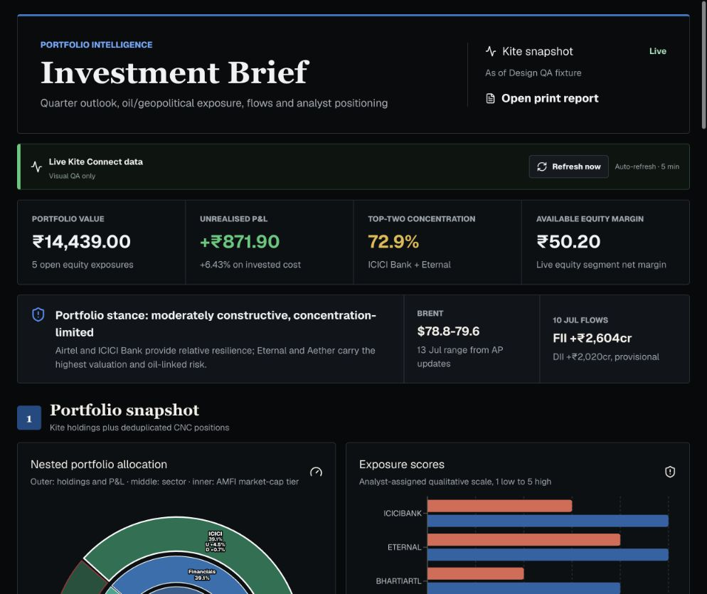
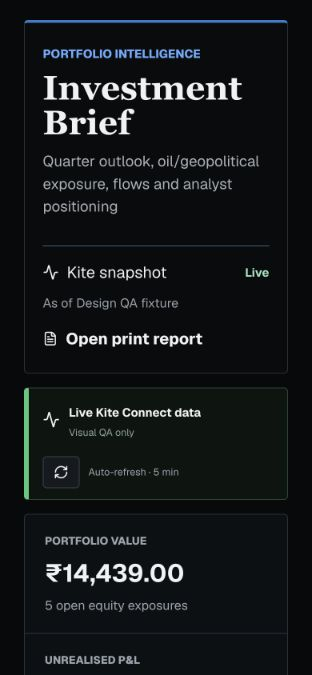
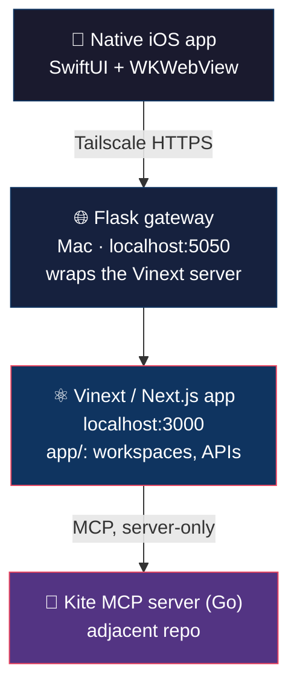

<div align="center">

# 📊 Investment Dashboard

**A private, local-first portfolio intelligence platform for Indian equities**


</div>

Investment Dashboard combines a live 🔴 **Zerodha Kite** portfolio feed with
📰 Axis Research briefs, a newsletter digest, 🏭 sector/earnings analytics,
🌍 macro scenarios, and a private 🩺 health & wellness workspace — served
from a Mac and mirrored to a native iPhone app over Tailscale.

> 🔒 **Nothing leaves your machine.** Kite credentials, Mail, Podcasts, and
> Health data are all read and stored server-side on `localhost`.

<p align="center">
  
</p>
<p align="center">
  
</p>

---

## ✨ What it does

| | |
|---|---|
| 📈 **Live Kite portfolio** | Holdings, positions, orders, GTTs, and margins pulled through a server-only MCP session, refreshed every 5 minutes |
| 📰 **Research digest** | The latest Axis Research brief and an Apple Mail newsletter digest, scoped to exactly the `Axis Research` and `Newsletters` mailboxes, promos stripped out |
| 🏭 **Sector & earnings analytics** | Industry benchmarks, a decision lab (PESTEL / Porter's / macro triggers), and a full earnings calendar matched against holdings |
| 🩺 **Health & wellness** | A private HealthKit-backed workspace (Activity, Sleep, Heart, Respiratory, Mobility, Nutrition) with 7-day/30-day comparisons |
| 🧾 **PDF reporting** | One-click export of the full Investment Brief |
| 📱 **Native iPhone app** | A SwiftUI shell with a persistent WKWebView, its own onboarding, offline recovery, and HealthKit sync |

---

## 🏗️ Architecture



The Vinext/Next.js app is the core of the dashboard. The Flask gateway wraps
it as a local macOS background service and is what the native app and PWA
actually connect to. Everything binds to `localhost`; Tailscale Serve is the
only way the iPhone reaches it remotely, so nothing is exposed to the open
internet.

---

## ✅ Prerequisites

- 🟢 Node.js `>=22.13.0`
- 🐍 Python 3.10+ (for the private Flask gateway)
- 🔑 A Zerodha Kite Connect account and API credentials
- 🍎 macOS, for the Mail/Podcasts/Reminders/Calendar/Health integrations and
  the native app build
- 🛰️ [Tailscale](https://tailscale.com/) for private remote/mobile access
  (optional, but required for the iPhone app off your home Wi-Fi)

---

## 🚀 Quick start

```bash
npm install
npm run dev      # local development server
npm run build     # verify the production build
```

To run the full dashboard as a private macOS + iPhone app via Flask:

```bash
npm run flask:setup   # creates an isolated .venv-flask environment
npm run iphone         # starts the local-only background service
```

Install the Mac Dock app once with `npm run desktop`, or open
`http://localhost:5050/` in Safari and use **File → Add to Dock**. For iPhone,
`npm run iphone` prints an install URL (Tailscale if signed in, otherwise
same-Wi-Fi LAN) — open it in Safari and **Share → Add to Home Screen**, or
install the native SwiftUI app (see below). A setup guide is also served at
`/install`.

### 📱 Native iPhone app (recommended)

The primary iPhone client is the SwiftUI project at
`apple-app/InvestmentDashboard.xcodeproj`. It provides native onboarding,
workspace navigation, source-freshness/connection status, operational-day
HealthKit upload, offline recovery, and PDF sharing around one persistent
WKWebView. Full build, install, and TestFlight instructions are in
[`apple-app/README.md`](apple-app/README.md).

After installing it, pair HealthKit once from the Mac:

```bash
npm run iphone:pair
```

The upload token lives in the iPhone Keychain; the Mac stores only its hash.
The app refreshes every dashboard source on foreground, on reconnect, on
manual refresh, and every 5 minutes while active — Mac-side changes show up
without reinstalling.

### 🛰️ Remote / mobile-data access

Install Tailscale on both the Mac and iPhone, sign into the same tailnet,
then:

```bash
npm run remote
```

This prints the Mac's stable Tailscale address and configures Tailscale Serve
for the Flask gateway. The native app defaults to that private tailnet URL.

---

## 🗂️ Workspaces

The dashboard has four persistent workspaces, each reachable via a `?view=`
query param and mirrored 1:1 in the native app:

| Workspace | Route | Contents |
|---|---|---|
| 💼 **Investment** | `?view=investment` | Action board, live Kite snapshot, macro scenarios, analyst calls, risk views, Axis recommendations |
| 🏭 **Sectoral Analytics** | `?view=sectors` | A 2×2 console: Action Board, Industry Analytics, Benchmarks & Decision Lab, Earnings Calendar |
| 📰 **Market Intelligence** | `?view=intelligence` | Daily action board plus the full digest — newsletters, Axis Research, calendar/action feeds, Reminders, Notes, Podcasts |
| 🩺 **Health & Wellness** | `?view=health` | A private 2×2 console: Action Board, Health Status, Daily Guidance, Vital Metrics (incognito-gated) |

Every action board shares the same three-lane contract (`To Do Today` /
`Monitor` / `Completed Today`) and visual language — the Investment board is
the canonical layout that the others match.

> ⚠️ **Filtering boundary:** the industry selector inside Sectoral Analytics
> only ever filters that workspace. Market Intelligence always shows the
> complete, unfiltered digest (including the earnings calendar), and the
> Earnings Calendar always keeps every tracked event visible regardless of
> any sector filter. This boundary is covered by the rendered-dashboard
> tests — see [`AGENTS.md`](AGENTS.md) for the full behavioral contract.

---

## 🔑 Kite authentication

The dashboard starts the local Kite MCP server automatically and reads
holdings, positions, margins, orders, and GTTs through a server-only MCP
session. Holdings are treated as the critical live read; the other endpoints
fail gracefully so one flaky Kite call can't blank the portfolio view. When
live Kite is unavailable, the UI falls back to the last validated snapshot and
never presents it as live.

Use the **Authenticate Kite** action only when a session genuinely needs it.
After one login, the access token is valid until Zerodha's daily ~06:00 IST
regulatory cutover — not a fixed 12-hour window. Avoid extra same-day logins,
since a new login can invalidate the previous token for the same API key. PDF
export needs a live post-login snapshot.

```bash
KITE_MCP_PROJECT_DIR=/path/to/kite-mcp-server npm run dev
KITE_MCP_URL=http://127.0.0.1:8080/mcp npm run dev
```

The active integration is the Go MCP server in the adjacent `kite-mcp-server`
repository (set `KITE_MCP_PROJECT_DIR` if it lives elsewhere).
`integrations/kite-connect-mcp-typescript/` is an earlier TypeScript
prototype, kept for reference but not started by the dashboard.

---

## 📚 Research sources

- 📁 Primary knowledge base: local Axis Research folder (path configured per
  machine)
- 🗞️ Backbone: the latest prior Investment Brief and Newsletter Digest
- 📡 Live source of truth: Kite holdings, positions, orders, GTTs, margins
- 🌐 Supplemental: public web sources, Apple Mail digests, Apple Podcasts,
  the local earnings calendar

Apple Mail summaries are drawn from exactly the iCloud `Newsletters` and
`Axis Research` mailboxes, with promotions, calls-to-action, and contact
details stripped from what's displayed. Podcast items are deduplicated by
episode title and labeled as transcript- or description-sourced. Health
refresh validates the newest iCloud Apple Health export before importing it;
a corrupt archive falls back to the last validated snapshot rather than
overwriting it. Full source-freshness and refresh-contract details are in
[`AGENTS.md`](AGENTS.md).

---

## 📁 Project layout

```
app/                                        dashboard workspaces, report route, live APIs, data definitions
apple-app/InvestmentDashboard.xcodeproj/    native macOS/iOS wrapper app
scripts/                                    macOS launchers + Kite/Mail/podcast/PDF/Tailscale helpers
integrations/kite-connect-mcp-typescript/   retained TypeScript Kite MCP prototype
artifacts/reports/                          generated report artifacts kept with the project
artifacts/design-qa/                        visual QA reference screenshots
notion/                                     project summary and file-organization history
db/, drizzle/                               optional local D1 schema and migrations
tests/                                       Node and Python test suites
```

---

## ⚙️ Useful commands

| Command | Description |
|---|---|
| `npm run dev` | ▶️ Start local development |
| `npm run build` | 🏗️ Verify the production build |
| `npm run flask:setup` | 🐍 Create the private Python env and install Flask |
| `npm run flask` / `npm run flask:stop` | 🟢🔴 Start/stop the local macOS background service |
| `npm run iphone` | 📱 Start the same local-only service, printing install URLs |
| `npm run iphone:native` | 🔨 Build and install the native app on a connected iPhone |
| `npm run iphone:pair` | 🔗 Generate a one-time HealthKit pairing code |
| `npm run remote` | 🛰️ Start the gateway and print the private Tailscale URL |
| `npm run desktop` | 🖥️ Install the Mac Dock app |
| `npm test` | ✅ Build and run the rendered-dashboard test suite |
| `npm run lint` | 🧹 Run ESLint |
| `npm run db:generate` | 🗃️ Generate Drizzle migrations after schema changes |

---

## 🧪 Testing

```bash
npm test
# or individually:
node --test tests/rendered-html.test.mjs
node --experimental-strip-types --test tests/freshness-and-isolation.test.mjs tests/health-date-policy.test.mjs
python3 -m unittest discover -s tests -p 'test_health_import.py'
```

`tests/rendered-html.test.mjs` specifically covers workspace structure and the
Sectoral/Market-Intelligence filter isolation described above — any change to
that filtering logic should keep this suite green.

---

## 🔐 Security & privacy

- 🚫 Broker credentials, Mail, Podcasts, and Health data never leave the Mac.
- 🏠 The Vinext server and Flask gateway bind to `localhost` only; Tailscale
  Serve is the sole remote-access path, and it's tailnet-private, not public.
- 🔑 HealthKit upload tokens are per-install, stored in the iPhone Keychain,
  and the server keeps only a hash.
- 🙈 Private artifacts and token registries are git-ignored.
- 👤 This is a personal tool, not intended for public deployment or
  distribution (see the TestFlight checklist in `apple-app/README.md`).

---

## 🧹 Repo hygiene note

`.firecrawl/` is listed in `.gitignore`, but ~2,000 files from an earlier
`firecrawl-cli` install (mostly its `node_modules/`) were committed before
that rule was added and are still tracked (commit `0c71858`, "Firecrawl
Integration"). Nothing sensitive lives in there — the one credential-shaped
file, `.firecrawl/fii-dii/nse-cookies.txt`, is an empty curl-generated
placeholder in every commit it appears in — but it's ~17 MB of dependency
code that doesn't belong in version control. Worth a `git rm -r --cached
.firecrawl` cleanup commit when convenient; no history rewrite needed since
no real secret was ever committed there.

---

## 🏚️ Scaffolding notes

This project started from a Vinext/Next.js "site creator" starter template
([vinext](https://github.com/cloudflare/vinext)), which is why
`.openai/hosting.json`, `vite.config.ts`, and `app/chatgpt-auth.ts` still exist
for optional D1/R2 bindings and ChatGPT sign-in support. None of that
scaffolding is used by the dashboard itself — it's kept only in case those
hosting paths are needed later.

---

## 📖 Learn more

- 📘 [vinext documentation](https://github.com/cloudflare/vinext)
- 📗 [Drizzle D1 guide](https://orm.drizzle.team/docs/get-started/d1-new)
- 📄 [`AGENTS.md`](AGENTS.md) — the full data-freshness and refresh-contract spec
- 📱 [`apple-app/README.md`](apple-app/README.md) — native app build/install/TestFlight guide

<div align="center">

---

Made for personal use by Aditya · 🇮🇳 tracking Indian equities, one refresh at a time

</div>
